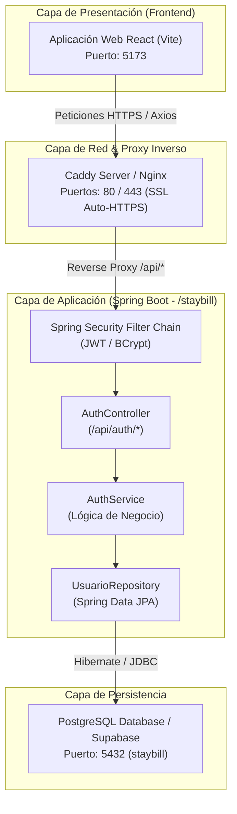
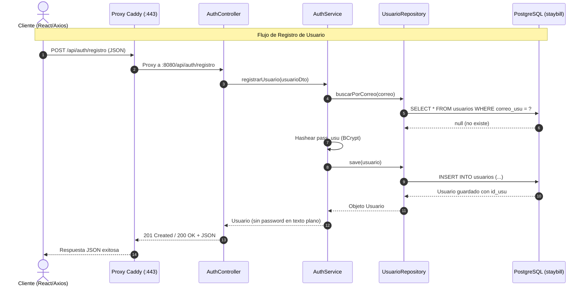
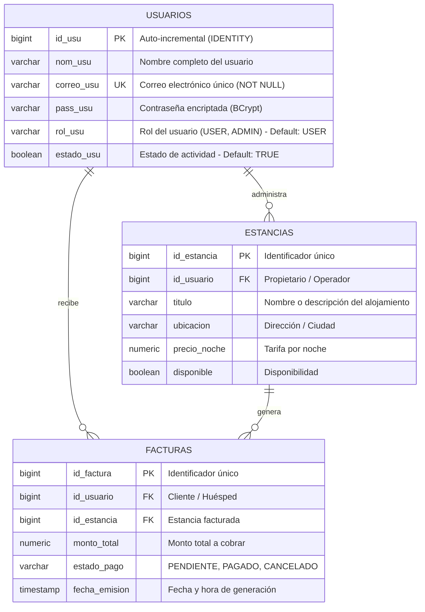

# Sistema de Diseño y Especificación Técnica de Arquitectura de Backend (StayBill API)

> **Documento de Diseño de Software y Especificación de Endpoints**  
> **Proyecto:** StayBill Backend  
> **Ubicación del Módulo:** `/staybill`  
> **Versión:** `1.0.0`  
> **Fecha:** Octubre 2026  
> **Tecnologías Core:** Java 21, Spring Boot, Spring Data JPA, Spring Security, PostgreSQL, Hibernate ORM.

---

## 1. Resumen Ejecutivo y Objetivos del Sistema

**StayBill** es una plataforma diseñada para la gestión de alojamientos, estancias y procesos de facturación automatizada. El módulo backend (`staybill`) proporciona una arquitectura de servicios RESTful segura, escalable y mantenible para ser consumida por clientes web (React / Vite), aplicaciones móviles y servicios externos a través de proxies inversos seguros (Caddy / Nginx).

### 1.1 Principios de Diseño
* **Arquitectura por Capas (Layered Architecture):** Separación estricta de responsabilidades entre Controlador (`Controller`), Servicio (`Service`), Repositorio (`Repository`) y Modelo de Dominio (`Entity / DTO`).
* **API REST Stateless:** Autenticación basada en tokens, sin estado en sesión de servidor.
* **Seguridad por Diseño (Security by Design):** Contraseñas hasheadas con algoritmos robustos (BCrypt), control de acceso basado en roles (RBAC) y sanitización de entradas.
* **Respuestas Estándar y Manejo Global de Excepciones:** Contratos JSON predecibles para respuestas exitosas y de error.

---

## 2. Arquitectura del Sistema

### 2.1 Diagrama de Arquitectura Global (Cliente - Servidor con Proxy Inverso)



### 2.2 Flujo de Autenticación y Registro



---

## 3. Modelo de Datos y Esquema de Base de Datos

### 3.1 Diagrama Entidad - Relación (ERD)



### 3.2 Definición de Tablas Principales

#### Tabla `usuarios`
| Columna | Tipo SQL | Restricciones | Descripción |
| :--- | :--- | :--- | :--- |
| `id_usu` | `BIGINT` (Identity) | `PRIMARY KEY`, `NOT NULL` | Identificador único del usuario |
| `nom_usu` | `VARCHAR(255)` | `NULLABLE` | Nombre de usuario o nombre completo |
| `correo_usu` | `VARCHAR(255)` | `UNIQUE`, `NOT NULL` | Correo electrónico utilizado para login |
| `pass_usu` | `VARCHAR(255)` | `NOT NULL` | Hash de la contraseña (BCrypt) |
| `rol_usu` | `VARCHAR(50)` | `DEFAULT 'USER'` | Rol asignado (`USER`, `ADMIN`, `HOST`) |
| `estado_usu`| `BOOLEAN` | `DEFAULT TRUE` | Indicador de cuenta activa / inactiva |

---

## 4. Especificación Técnica de Endpoints (API REST)

**URL Base de la API:**
- Desarrollo directo: `http://localhost:8080`
- Mediante Proxy Inverso (Caddy / Producción): `https://localhost/api` o `https://api.staybill.local`

---

### 4.1 Módulo de Autenticación (`/api/auth`)

#### 4.1.1 Registro de Usuario
Crea y persiste un nuevo usuario en la base de datos de StayBill.

* **Método:** `POST`
* **Ruta:** `/api/auth/registro`
* **Acceso / Seguridad:** Público (`permitAll`)
* **Headers:**
  ```http
  Content-Type: application/json
  ```

* **Request Body:**
```json
{
  "nom_usu": "Carlos Mendoza",
  "correo_usu": "carlos.mendoza@staybill.com",
  "pass_usu": "MiClaveSegura123*",
  "rol_usu": "USER",
  "estado_usu": true
}
```

* **Respuestas:**
  * **201 Created / 200 OK (Éxito):**
    ```json
    {
      "id_usu": 1,
      "nom_usu": "Carlos Mendoza",
      "correo_usu": "carlos.mendoza@staybill.com",
      "pass_usu": "$2a$10$e8wF3Qv1YlY.xH0G1v7...",
      "rol_usu": "USER",
      "estado_usu": true
    }
    ```
  * **400 Bad Request (Error de Validación o Correo Duplicado):**
    ```json
    {
      "timestamp": "2026-10-05T15:50:00Z",
      "status": 400,
      "error": "Bad Request",
      "message": "El correo electrónico ya se encuentra registrado",
      "path": "/api/auth/registro"
    }
    ```

* **Ejemplo cURL:**
```bash
curl -X POST "http://localhost:8080/api/auth/registro" \
  -H "Content-Type: application/json" \
  -d '{
    "nom_usu": "Carlos Mendoza",
    "correo_usu": "carlos.mendoza@staybill.com",
    "pass_usu": "MiClaveSegura123*",
    "rol_usu": "USER",
    "estado_usu": true
  }'
```

---

#### 4.1.2 Inicio de Sesión (Login) *(Próxima Implementación)*
Autentica credenciales y genera un JSON Web Token (JWT) para sesiones subsecuentes.

* **Método:** `POST`
* **Ruta:** `/api/auth/login`
* **Acceso / Seguridad:** Público (`permitAll`)
* **Headers:**
  ```http
  Content-Type: application/json
  ```

* **Request Body:**
```json
{
  "correo_usu": "carlos.mendoza@staybill.com",
  "pass_usu": "MiClaveSegura123*"
}
```

* **Respuestas:**
  * **200 OK:**
    ```json
    {
      "token": "eyJhbGciOiJIUzI1NiIsInR5cCI6IkpXVCJ9...",
      "tipo": "Bearer",
      "id_usu": 1,
      "nom_usu": "Carlos Mendoza",
      "correo_usu": "carlos.mendoza@staybill.com",
      "rol_usu": "USER"
    }
    ```
  * **401 Unauthorized:**
    ```json
    {
      "timestamp": "2026-10-05T15:52:00Z",
      "status": 401,
      "error": "Unauthorized",
      "message": "Credenciales inválidas (correo o contraseña incorrectos)",
      "path": "/api/auth/login"
    }
    ```

---

#### 4.1.3 Perfil del Usuario Autenticado (`/me`) *(Próxima Implementación)*
Obtiene los detalles del usuario en sesión activa.

* **Método:** `GET`
* **Ruta:** `/api/auth/perfil`
* **Acceso / Seguridad:** Autenticado (`Bearer Token`)
* **Headers:**
  ```http
  Authorization: Bearer <TOKEN_JWT>
  ```

* **Respuestas:**
  * **200 OK:**
    ```json
    {
      "id_usu": 1,
      "nom_usu": "Carlos Mendoza",
      "correo_usu": "carlos.mendoza@staybill.com",
      "rol_usu": "USER",
      "estado_usu": true
    }
    ```

---

### 4.2 Módulo de Estancias y Alojamientos (`/api/estancias`) *(Especificación de Dominio)*

| Método | Endpoint | Roles Permitidos | Descripción |
| :--- | :--- | :--- | :--- |
| `GET` | `/api/estancias` | `PermitAll` / `USER` | Lista de alojamientos disponibles |
| `GET` | `/api/estancias/{id}` | `PermitAll` / `USER` | Detalle de un alojamiento específico |
| `POST` | `/api/estancias` | `ADMIN`, `HOST` | Registro de nueva propiedad/alojamiento |
| `PUT` | `/api/estancias/{id}` | `ADMIN`, `HOST` | Actualización de tarifas o disponibilidad |
| `DELETE` | `/api/estancias/{id}` | `ADMIN` | Eliminación lógica de alojamiento |

---

### 4.3 Módulo de Facturación (`/api/facturas` - StayBill Core) *(Especificación de Dominio)*

| Método | Endpoint | Roles Permitidos | Descripción |
| :--- | :--- | :--- | :--- |
| `GET` | `/api/facturas` | `USER` (propias), `ADMIN` | Historial de facturas generadas |
| `POST` | `/api/facturas/generar` | `USER`, `ADMIN` | Generación y cálculo de factura por estancia |
| `GET` | `/api/facturas/{id}` | `USER`, `ADMIN` | Consulta detallada con desglose de impuestos y noches |
| `GET` | `/api/facturas/{id}/pdf`| `USER`, `ADMIN` | Descarga de comprobante de pago en formato PDF |

---

## 5. Estructura de Proyecto y Convenciones de Código

La organización recomendada para el backend `staybill` sigue las mejores prácticas de Spring Boot:

```
staybill/
├── src/main/java/com/api/staybill/
│   ├── StaybillApplication.java      # Punto de entrada principal
│   ├── config/                       # Configuraciones de seguridad, CORS, WebMvc
│   │   ├── SecurityConfig.java
│   │   ├── CorsConfig.java
│   │   └── JwtProvider.java
│   ├── controller/                   # Controladores REST
│   │   ├── AuthController.java
│   │   ├── EstanciaController.java
│   │   └── FacturaController.java
│   ├── dto/                          # Data Transfer Objects (Request/Response DTOs)
│   │   ├── AuthRequestDto.java
│   │   ├── AuthResponseDto.java
│   │   └── UsuarioResponseDto.java
│   ├── exception/                    # Manejador global de excepciones
│   │   ├── GlobalExceptionHandler.java
│   │   └── ResourceNotFoundException.java
│   ├── model/                        # Entidades JPA
│   │   ├── Usuario.java
│   │   ├── Estancia.java
│   │   └── Factura.java
│   ├── repository/                   # Interfaces Spring Data JPA
│   │   ├── UsuarioRepository.java
│   │   ├── EstanciaRepository.java
│   │   └── FacturaRepository.java
│   └── service/                      # Lógica de negocio e interfaces
│       ├── AuthService.java
│       ├── EstanciaService.java
│       └── FacturaService.java
└── src/main/resources/
    └── application.properties        # Propiedades de DataSource, Hibernate y JWT
```

---

## 6. Configuración de Seguridad y Manejo de Errores

### 6.1 Formato Estándar de Respuesta de Error
Todas las excepciones capturadas por el backend deben retornar una estructura homogénea:

```json
{
  "timestamp": "2026-10-05T20:50:00.123Z",
  "status": 400,
  "error": "Nombre del Error HTTP",
  "message": "Descripción legible de la causa",
  "path": "/api/recurso/solicitado"
}
```

### 6.2 Buenas Prácticas de Seguridad en `AuthService`
1. **No almacenar contraseñas en texto plano:** Inyectar `PasswordEncoder` (`BCryptPasswordEncoder`) para hashear `pass_usu` antes de invocar `usuarioRepository.save(...)`.
2. **Ocultar hash de contraseña en respuestas:** No devolver `pass_usu` en los payloads JSON de respuesta al cliente (utilizar DTOs `UsuarioResponseDto` o `@JsonProperty(access = Access.WRITE_ONLY)`).

---

## 7. Configuración de Infraestructura y Proxy Inverso

### 7.1 Archivo de Configuración de Caddy (`Caddyfile`)

Caddy gestiona automáticamente los certificados SSL/TLS y el enrutamiento entre el frontend React y la API Spring Boot:

```caddyfile
# Dominio local o público
localhost:443, staybill.local {
    tls internal

    # Enrutamiento de peticiones API hacia el Backend Spring Boot
    handle /api/* {
        reverse_proxy localhost:8080 {
            header_up Host {host}
            header_up X-Real-IP {remote_host}
            header_up X-Forwarded-For {remote_host}
            header_up X-Forwarded-Proto {scheme}
        }
    }

    # Enrutamiento hacia la aplicación Frontend (Vite / React)
    handle {
        reverse_proxy localhost:5173
    }
}
```

### 7.2 Docker Compose Sugerido (`docker-compose.yml`)

```yaml
version: '3.8'

services:
  postgres-db:
    image: postgres:16-alpine
    container_name: staybill_postgres
    restart: always
    environment:
      POSTGRES_DB: staybill
      POSTGRES_USER: postgres
      POSTGRES_PASSWORD: ${DB_PASSWORD:-12345}
    ports:
      - "5432:5432"
    volumes:
      - postgres_data:/var/lib/postgresql/data

  backend:
    build: ./staybill
    container_name: staybill_backend
    restart: always
    depends_on:
      - postgres-db
    environment:
      SPRING_DATASOURCE_URL: jdbc:postgresql://postgres-db:5432/staybill
      SPRING_DATASOURCE_USERNAME: postgres
      SPRING_DATASOURCE_PASSWORD: ${DB_PASSWORD:-12345}
    ports:
      - "8080:8080"

volumes:
  postgres_data:
```

---

## 8. Integración con el Frontend (React + Axios)

Configuración recomendada para `frontend-app-ing-web/src/api/axios.js`:

```javascript
import axios from 'axios';

const api = axios.create({
  baseURL: import.meta.env.VITE_API_BASE_URL || 'http://localhost:8080/api',
  headers: {
    'Content-Type': 'application/json',
  },
});

// Interceptor para inyectar token JWT si existe en LocalStorage
api.interceptors.request.use((config) => {
  const token = localStorage.getItem('staybill_token');
  if (token) {
    config.headers.Authorization = `Bearer ${token}`;
  }
  return config;
});

export default api;
```

---

## 9. Estado y Checklist de Implementación

- [x] Conexión a Base de Datos PostgreSQL configurada (`application.properties`).
- [x] Entidad `Usuario` con campos `id_usu`, `nom_usu`, `correo_usu`, `pass_usu`, `rol_usu`, `estado_usu`.
- [x] Repositorio `UsuarioRepository` con consulta personalizada `buscarPorCorreo`.
- [x] Endpoint `POST /api/auth/registro` operativo.
- [ ] Incorporación de `BCryptPasswordEncoder` en `AuthService`.
- [ ] Implementación de `POST /api/auth/login` con generación de token JWT.
- [ ] Implementación de DTOs (`UsuarioRequestDto`, `UsuarioResponseDto`) para no exponer hashes.
- [ ] Configuración de Proxy Inverso Caddy / Nginx para entornos de desarrollo y producción.
- [ ] Modelado de entidades de negocio: `Estancia` y `Factura`.
