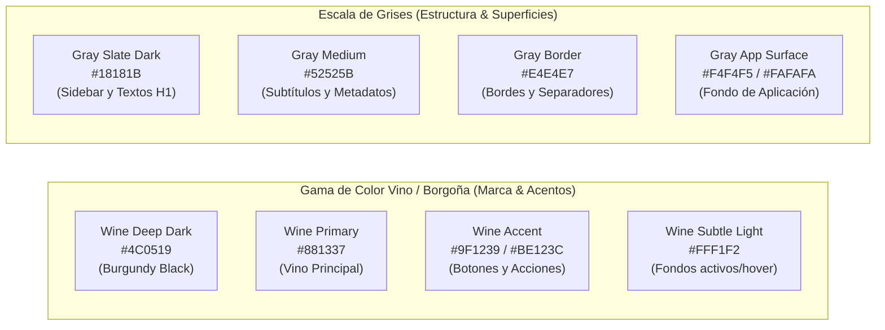

# Sistema de Estilo y Guía de Diseño UI para Google Stitch (StayBill)

> **Documento de Especificación Visual, Tokens de Diseño y Prompts para Google Stitch**  
> **Aplicación:** StayBill (Gestión Hotelera y Facturación Inteligente)  
> **Paleta Principal:** Vino / Burgundy (`#881337`, `#9F1239`, `#4C0519`) & Escala de Grises (`#18181B`, `#52525B`, `#E4E4E7`, `#F4F4F5`)  
> **Compatibilidad:** Google Stitch MCP, Figma Tokens, Tailwind CSS, React 19 + Vite  
> **Versión:** `2.0.0` (Actualizado con Paleta Vino & Gris)

---

## 1. Identidad Visual y Filosofía de Diseño

**StayBill** adopta una identidad visual refinada, sobria y de alta gama inspirada en la hotelería boutique y plataformas financieras modernas (*Boutique FinTech Hospitality*).

### 1.1 Pilares de Diseño
1. **Elegancia Sobria (Vino & Gris):** El tono vino aporta sofisticación, calidez y distinción de marca, mientras que la escala de grises neutros garantiza un entorno de trabajo financiero limpio, descansado y de alto contraste.
2. **Claridad Numérica y Financiera:** Facturas, métricas y tarifas se presentan con total nitidez sobre tarjetas grises y blancas con bordes sutiles.
3. **Micro-interacciones y Feedback Inmediato:** Badges de estado refinados (`Pagado`, `Pendiente`, `Cancelado`), botones con relieve sutil y transiciones fluidas (`150ms - 200ms`).

---

## 2. Design Tokens (Paleta Vino & Gris)

### 2.1 Paleta Cromática



| Token de Color | Valor HEX | Rol Semántico |
| :--- | :--- | :--- |
| `--color-brand-wine-dark` | `#4C0519` | Encabezados de máximo contraste, badges vino, acentos profundos |
| `--color-brand-wine` | `#881337` | Color insignia de la marca StayBill |
| `--color-brand-wine-accent` | `#9F1239` | Botones de acción primaria, enlaces activos, focus rings |
| `--color-brand-wine-hover` | `#BE123C` | Estado hover de botones primarios |
| `--color-brand-wine-subtle`| `#FFF1F2` | Fondo suave de selección, chips y badges de marca |
| `--color-gray-900` | `#18181B` | Sidebar oscuro, títulos principales |
| `--color-gray-700` | `#3F3F46` | Texto regular y etiquetas de formulario |
| `--color-gray-500` | `#71717A` | Subtítulos, iconos secundarios y placeholders |
| `--color-gray-200` | `#E4E4E7` | Líneas divisorias, bordes de inputs y cards |
| `--color-gray-100` | `#F4F4F5` | Fondo general de la aplicación |
| `--color-surface-card` | `#FFFFFF` | Tarjetas, modales, contenedores de tablas |
| `--color-success` | `#059669` | Facturas pagadas, estados activos (`estado_usu: true`) |
| `--color-warning` | `#D97706` | Facturas pendientes, avisos de reserva |
| `--color-danger` | `#B91C1C` | Errores de validación, eliminación |

---

### 2.2 Tipografía

* **Tipografía Primaria (UI & Body):** `Plus Jakarta Sans`, `Inter`, sans-serif.
* **Tipografía Numérica y Encabezados de Impacto:** `Outfit`, `Sora`, sans-serif.

| Nivel | Tamaño (px / rem) | Peso (Font-Weight) | Altura de Línea (Line-Height) |
| :--- | :--- | :--- | :--- |
| **Display / Hero** | `36px` (`2.25rem`) | `700 Bold` | `1.2` |
| **H1 (Páginas principales)** | `28px` (`1.75rem`) | `700 Bold` | `1.25` |
| **H2 (Secciones & Cards)** | `20px` (`1.25rem`) | `600 SemiBold` | `1.3` |
| **H3 (Subsecciones)** | `16px` (`1.00rem`) | `600 SemiBold` | `1.4` |
| **Body (Texto base)** | `14px` (`0.875rem`)| `400 Regular` | `1.5` |
| **Body Bold** | `14px` (`0.875rem`)| `600 SemiBold` | `1.5` |
| **Caption / Metadatos** | `12px` (`0.75rem`) | `500 Medium` | `1.4` |

---

### 2.3 Espaciado, Radios y Elevaciones (Sombras)

* **Grid Base:** Múltiplos de 4px / 8px (`4px`, `8px`, `12px`, `16px`, `24px`, `32px`, `48px`).
* **Border Radii:**
  * `rounded-sm`: `6px` (Badges, tags)
  * `rounded-md`: `10px` (Inputs, botones, selects)
  * `rounded-lg`: `16px` (Cards, contenedores de sección, modales)
  * `rounded-full`: `9999px` (Avatares, pills de estado)
* **Sombras (Box-Shadows):**
  * `shadow-card`: `0 1px 3px 0 rgba(24, 24, 27, 0.05), 0 1px 2px 0 rgba(24, 24, 27, 0.03)`
  * `shadow-hover`: `0 10px 15px -3px rgba(24, 24, 27, 0.07), 0 4px 6px -2px rgba(24, 24, 27, 0.03)`
  * `shadow-modal`: `0 20px 25px -5px rgba(24, 24, 27, 0.1), 0 10px 10px -5px rgba(24, 24, 27, 0.04)`

---

## 3. Especificación de Componentes Clave

```
+-----------------------------------------------------------------------------------+
|  [🍷 StayBill]      [Dashboard]   [Estancias]   [Facturas]      (👤 Carlos M.)    |
+-----------------------------------------------------------------------------------+
|                                                                                   |
|  Gestión de Estancias y Facturación                                [+ Nueva Estancia] |
|                                                                                   |
|  +-------------------+  +-------------------+  +-------------------+              |
|  | Total Facturado   |  | Estancias Activas |  | Facturas Pend.    |              |
|  | $14,850.00 USD    |  | 18 Habitaciones   |  | 4 Por cobrar      |              |
|  +-------------------+  +-------------------+  +-------------------+              |
|                                                                                   |
|  Historial de Facturas Recientes                                                   |
|  +-----------------------------------------------------------------------------+  |
|  | Factura #  | Huésped / Usuario | Estancia         | Monto     | Estado      |  |
|  |------------+-------------------+------------------+-----------+-------------|  |
|  | #INV-20261 | Carlos Mendoza    | Suite Ocean View | $350.00   | [● Pagado]  |  |
|  | #INV-20262 | Ana Valencia      | Loft Moderno     | $180.00   | [● Pend.]   |  |
|  +-----------------------------------------------------------------------------+  |
+-----------------------------------------------------------------------------------+
```

### 3.1 Botones
* **Botón Primario (Vino):** Fondo `#9F1239`, texto `#FFFFFF`, radio `10px`, padding `10px 20px`, texto en `14px 600 SemiBold`. Hover `#BE123C`. Focus ring `0 0 0 3px rgba(159, 18, 57, 0.25)`.
* **Botón Secundario (Gris):** Fondo `#F4F4F5`, texto `#18181B`, borde `1px solid #E4E4E7`. Hover `#E4E4E7`.
* **Botón Peligro:** Fondo `#FEE2E2`, texto `#991B1B`, borde `1px solid #FECACA`. Hover `#FCA5A5`.

### 3.2 Inputs y Formularios (Mapeo a Modelo `Usuario`)
* **Input Text / Password / Email:**
  * Fondo blanco, borde `1px solid #E4E4E7`.
  * Focus: Borde `#9F1239` (vino), `outline: none`, `box-shadow: 0 0 0 3px rgba(159, 18, 57, 0.15)`.
  * Icono en gris neutro (`#71717A`) a la izquierda.
  * Botón para alternar visibilidad de contraseña (ojo).

### 3.3 Badges de Estado (Pills)
* **Pagado / Activo (`estado_usu: true`):** Fondo `#ECFDF5`, Texto `#065F46`, Icono punto verde.
* **Pendiente / Revisión:** Fondo `#FFFBEB`, Texto `#92400E`, Icono punto ámbar.
* **Cancelado / Inactivo (`estado_usu: false`):** Fondo `#FFF1F2`, Texto `#881337`, Icono punto vino.

---

## 4. Prompts Actualizados para Google Stitch (Paleta Vino & Gris)

Copia y pega estos prompts directamente en **Google Stitch** para generar componentes y pantallas con la estética Vino y Gris:

---

### 🎨 Prompt 1: Pantalla de Registro y Autenticación (`Auth Screen`)

```text
Create a modern, luxury-boutique split-screen authentication interface for "StayBill" (hotel stay management & automated invoicing web app).
Design System & Color Requirements:
- Color Palette: Deep Wine/Burgundy (#4C0519, #881337, #9F1239), Charcoal Gray (#18181B), Neutral Light Grays (#F4F4F5, #E4E4E7), and Pure White (#FFFFFF). No blue tones.
- Left Column (45% width): Brand showcase with a rich deep wine (#4C0519) background with subtle dark burgundy geometric lines (#881337) and warm ambient glow. Display the "StayBill" logo, bold headline "Gestión Hotelera y Facturación Inteligente", and 3 glassmorphic bullet cards (Emisión Instantánea de Facturas, Control de Alojamientos, Huéspedes y Tarifas).
- Right Column (55% width): Clean white surface (#FFFFFF) on #F4F4F5 background. Include tab buttons to toggle between "Crear Cuenta" (Register) and "Iniciar Sesión" (Login).
- Form Fields for Register (connected to POST /api/auth/registro):
  1. Full Name input (nom_usu) with gray user icon placeholder "Carlos Mendoza".
  2. Email input (correo_usu) with mail icon placeholder "carlos.mendoza@staybill.com".
  3. Password input (pass_usu) with lock icon, strength indicator bar, and eye reveal toggle.
  4. Role selection pills (rol_usu): "Huésped / Cliente (USER)" and "Administrador / Host (ADMIN)".
  5. Terms checkbox and large primary button in vibrant wine (#9F1239) with text "Registrarse en StayBill".
- Visual Style: Rounded corners (12px), subtle gray borders (#E4E4E7), typography in Plus Jakarta Sans & Outfit.
```

---

### 🎨 Prompt 2: Dashboard Principal (Panel de Control y Métricas)

```text
Design a responsive web dashboard for "StayBill" SaaS platform using a wine and gray color theme.
Layout & Components:
- Sidebar (Left, 240px width, Dark Charcoal #18181B): StayBill logo in wine accent (#9F1239), Navigation items (Dashboard [active with wine highlight pill #881337], Alojamientos/Estancias, Facturas y Cobros, Huéspedes, Configuración), and bottom user profile badge for "Carlos Mendoza (Admin)".
- Top Navbar: Clean white (#FFFFFF) with bottom gray border (#E4E4E7). Global search bar for invoices/stays, Notification bell, currency selector ($ USD / € EUR), and primary action button "+ Nueva Factura" in wine (#9F1239).
- Metric KPI Cards Row (4 cards):
  1. "Total Facturado del Mes" - $24,580.00 USD (growth badge +14.2% in emerald).
  2. "Estancias Ocupadas" - 28 / 32 Habitaciones (progress bar in wine #881337).
  3. "Facturas Pendientes" - 5 Facturas ($1,420.00 USD) with soft amber badge.
  4. "Usuarios Registrados" - 142 Huéspedes activos.
- Main Section (2 Columns):
  - Left (60%): Interactive Recent Invoices Table with columns (N° Factura, Huésped, Estancia, Fecha, Monto, Estado [Pagado/Pendiente pills], Acciones [PDF, Ver]).
  - Right (40%): Quick Stay Booking & Estimate Widget with calendar date picker, room selector, and instant total charge preview.
- Color Palette: #F4F4F5 background, #FFFFFF cards, #18181B typography, #9F1239 primary buttons, #E4E4E7 borders.
```

---

### 🎨 Prompt 3: Catálogo y Gestión de Estancias (`Alojamientos`)

```text
Design a modern web catalog grid for managing hotel rooms and stays in StayBill.
Theme: Wine (#881337, #9F1239) and Grayscale (#18181B, #52525B, #E4E4E7, #F4F4F5).
Features & Layout:
- Header: Title "Alojamientos y Habitaciones", search input by room name/category, filter chips (Todas, Disponibles, Ocupadas, En Limpieza), and a primary wine button "+ Agregar Estancia".
- Room Card Grid (3 columns):
  - Card 1: Master Suite Vista Jardín. High-res photo banner with "Disponible" pill badge. Price "$220 / noche" in bold Outfit font. Icons for 2 Camas, 1 Baño, WiFi, Balcón. Bottom buttons: "Facturar Estancia" (wine button) and "Detalles".
  - Card 2: Loft Ejecutivo Boutique. Photo banner with "Ocupada" amber badge. Current guest: "Ana Valencia".
  - Card 3: Habitación Estándar Confort. Photo banner with "Mantenimiento" gray badge.
- Drawer / Modal Preview: Opens when clicking a card to show stay history, billing ledger, and guest records.
- 16px border-radius, soft card shadows, #E4E4E7 borders, wine focus states.
```

---

### 🎨 Prompt 4: Módulo de Facturación y Comprobante PDF (`Invoices & Receipts`)

```text
Design an elegant Billing and Invoicing screen for StayBill using a wine and gray palette.
Elements to include:
- Invoices Table: Filter bar by status (Todas, Pagadas, Pendientes, Anuladas) and date range. Table columns for Invoice Number (#INV-2026-0104), Guest Name, Stay Name, Date, Total Amount, and PDF Download icon.
- Invoice Detail Receipt Modal:
  - Header: "StayBill Inc. - Facturación Electrónica" with wine accent logo (#9F1239), address, tax ID, and invoice number.
  - Bill To Section: Client name, email (nom_usu, correo_usu), payment method.
  - Itemized Charges Table:
    - Renta de Habitación (3 Noches x $140.00) = $420.00
    - Tarifa de Servicio y Desayuno = $45.00
    - Impuestos (IVA 16%) = $74.40
    - Total Liquidado = $539.40 USD (highlighted with bold dark wine text #4C0519).
  - Bottom actions: "Descargar PDF Comprobante" (primary wine button #9F1239), "Enviar por Correo" (gray secondary), and "Cerrar".
- Style: Ultra-clean document look, high typography contrast, 1px #E4E4E7 borders, and subtle wine accents.
```

---

## 5. Implementación de Tokens en CSS (`frontend-app-ing-web/src/index.css`)

```css
@import url('https://fonts.googleapis.com/css2?family=Outfit:wght@500;600;700&family=Plus+Jakarta+Sans:wght@400;500;600;700&display=swap');

:root {
  /* Tipografías */
  --font-body: 'Plus Jakarta Sans', -apple-system, BlinkMacSystemFont, sans-serif;
  --font-heading: 'Outfit', 'Plus Jakarta Sans', sans-serif;

  /* Paleta Vino / Burgundy */
  --color-brand-wine-dark: #4c0519;
  --color-brand-wine: #881337;
  --color-brand-wine-accent: #9f1239;
  --color-brand-wine-hover: #be123c;
  --color-brand-wine-subtle: #fff1f2;

  /* Escala de Grises y Superficies */
  --color-gray-900: #18181b;
  --color-gray-800: #27272a;
  --color-gray-700: #3f3f46;
  --color-gray-500: #71717a;
  --color-gray-300: #d4d4d8;
  --color-gray-200: #e4e4e7;
  --color-gray-100: #f4f4f5;
  --color-bg-app: #f4f4f5;
  --color-bg-card: #ffffff;

  /* Estados */
  --color-success: #059669;
  --color-success-bg: #ecfdf5;
  --color-warning: #d97706;
  --color-warning-bg: #fffbeb;
  --color-danger: #b91c1c;
  --color-danger-bg: #fff1f2;

  /* Radios y Sombras */
  --radius-sm: 6px;
  --radius-md: 10px;
  --radius-lg: 16px;
  --radius-full: 9999px;

  --shadow-card: 0 1px 3px 0 rgba(24, 24, 27, 0.05), 0 1px 2px 0 rgba(24, 24, 27, 0.03);
  --shadow-hover: 0 10px 15px -3px rgba(24, 24, 27, 0.07), 0 4px 6px -2px rgba(24, 24, 27, 0.03);
}

body {
  font-family: var(--font-body);
  background-color: var(--color-bg-app);
  color: var(--color-gray-900);
  margin: 0;
  padding: 0;
  -webkit-font-smoothing: antialiased;
}

h1, h2, h3, .heading-font {
  font-family: var(--font-heading);
  color: var(--color-gray-900);
}

.btn-primary {
  background-color: var(--color-brand-wine-accent);
  color: #ffffff;
  border-radius: var(--radius-md);
  padding: 10px 20px;
  font-weight: 600;
  border: none;
  cursor: pointer;
  transition: background-color 0.2s ease, transform 0.1s ease;
}

.btn-primary:hover {
  background-color: var(--color-brand-wine-hover);
}

.btn-secondary {
  background-color: var(--color-gray-100);
  color: var(--color-gray-900);
  border: 1px solid var(--color-gray-200);
  border-radius: var(--radius-md);
  padding: 10px 20px;
  font-weight: 600;
  cursor: pointer;
}

.badge-wine {
  background-color: var(--color-brand-wine-subtle);
  color: var(--color-brand-wine);
  padding: 4px 10px;
  border-radius: var(--radius-full);
  font-size: 12px;
  font-weight: 600;
}
```
